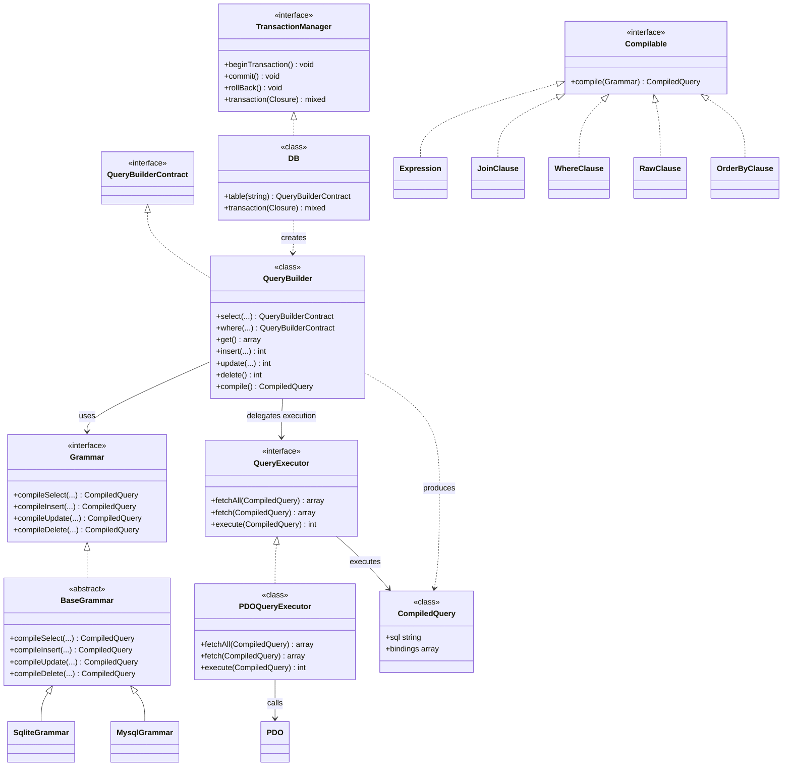
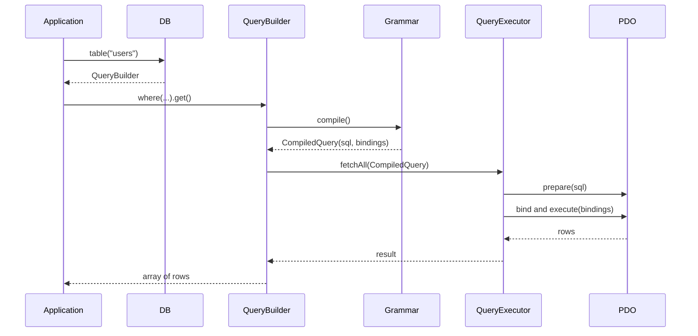

# Architecture and development

## Architecture

The architecture separates query construction, SQL dialect compilation, and
database side effects. Interfaces define the extension points; concrete classes
provide the default implementations.



### Query execution flow



## Development and testing

### Required programs

- Docker and Docker Compose version 2 or later
- make
- git

### Setup

```bash
git clone https://github.com/fostenslave/query-builder.git
cd query-builder
make init
```

The `make init` command builds the development container and installs Composer
dependencies.

### Common commands

```bash
make test
make composer CMD="validate --strict"
make clean
```

Run the test suite before committing changes

When adding a new SQL dialect, implement the `Grammar` contract. Extend
`BaseGrammar` when the shared compilation behavior is reusable, and add unit
tests for dialect-specific SQL generation.

When adding a new executable database integration, implement `QueryExecutor`
instead of coupling query construction to a concrete PDO adapter.
